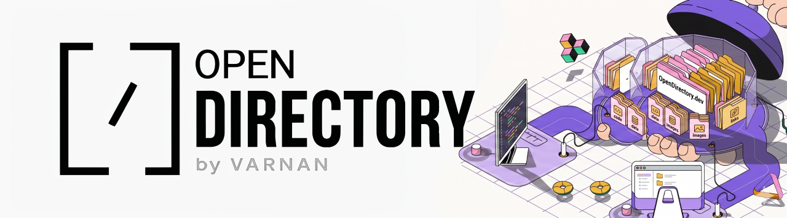

<div align="center">
  
</div>

<br />

<div align="center">
  <strong>A curated registry and CLI for AI Agent Skills, meticulously designed for Go-To-Market (GTM), Technical Marketing, and growth automation.</strong>
</div>

<div align="center">

[](https://www.npmjs.com/package/@opendirectory.dev/skills)
[](CONTRIBUTING.md)
[](https://opensource.org/licenses/MIT)

</div>

---

## What is OpenDirectory?

OpenDirectory is a central library that allows you to add new capabilities, or superpowers, to your AI agents. Instead of teaching your AI how to perform complex marketing or growth tasks from scratch, you can simply download a pre-built skill from our catalog and install it directly into your project.

## Available Skills

<!-- SKILLS_LIST_START -->

| Skill Name | Description | Version |
|---|---|---|
| `blog-cover-generator` |  | `1.0.17` |
| `claude-md-generator` |  | `1.0.0` |
| `cook-the-blog` |  | `1.0.0` |
| `dependency-update-bot` |  | `1.0.0` |
| `docs-from-code` |  | `1.0.0` |
| `explain-this-pr` |  | `1.0.0` |
| `seo-keyword-research` |  | `2.0` |
| `hackernews-intel` |  | `1.0.0` |
| `kill-the-standup` |  | `1.0.0` |
| `linkedin-post-generator` |  | `1.0.0` |
| `llms-txt-generator` |  | `1.0.0` |
| `luma-attendees-scraper` |  | `1.0.0` |
| `meeting-brief-generator` |  | `1.0.0` |
| `meta-ads-expert` |  | `0.0.1` |
| `newsletter-digest` |  | `1.0.0` |
| `noise2blog` |  | `1.0.0` |
| `outreach-sequence-builder` |  | `1.0.0` |
| `position-me` |  | `0.0.1` |
| `pr-description-writer` |  | `1.0.0` |
| `producthunt-launch-kit` |  | `1.0.0` |
| `reddit-icp-monitor` |  | `1.0.0` |
| `reddit-post-engine` |  | `1.0.0` |
| `schema-markup-generator` |  | `1.0.0` |
| `show-hn-writer` |  | `1.0.0` |
| `stargazer-deep-extractor` |  | `0.0.1` |
| `tweet-thread-from-blog` |  | `1.0.0` |
| `twitter-GTM-find-Skill` |  | `0.0.1` |
| `yc-jobs-scraper` |  | `0.0.1` |

<!-- SKILLS_LIST_END -->

## Prerequisites

Before you begin, you must have Node.js installed on your computer. Node.js provides the necessary tools to download and run these skills.

1. Visit [nodejs.org](https://nodejs.org/).
2. Download and install the version labeled Recommended For Most Users.
3. Once installed, you will have access to a tool called terminal or command prompt on your computer, which you will use for the following steps.

## Installation (Zero-Install Required)

Because we use `npx`, there is no need to install the OpenDirectory tool itself. `npx` is a magic command that comes with Node.js. When you type `npx "@opendirectory.dev/skills"`, your computer automatically downloads the registry in the background and runs it instantly.

## Native Installation (Claude Code Only)

Users who exclusively use Anthropic's Claude Code can add OpenDirectory as a native community marketplace directly inside their Claude interface. This allows you to install skills using Claude's built-in plugin system.

Run the following commands inside your Claude Code terminal:

```bash
# Add the OpenDirectory marketplace
/plugin marketplace add Varnan-Tech/opendirectory

# Install a skill directly
/plugin install opendirectory-gtm-skills@opendirectory-marketplace
```

## Step 1: View Available Skills

To see the full list of available skills, open your terminal and run the following command:

```bash
npx "@opendirectory.dev/skills" list
```

This command will display a list of all skills currently available in the OpenDirectory registry.

## Step 2: Choose Your Agent

OpenDirectory supports several different AI agents. When you install a skill, you need to tell the system which agent you are using by using the `--target` flag.

Supported agents include:

*   **Claude Code**: Use `--target claude`
*   **OpenCode**: Use `--target opencode`
*   **Codex**: Use `--target codex`
*   **Gemini CLI**: Use `--target gemini`
*   **Anti-Gravity**: Use `--target anti-gravity`
*   **OpenClaw**: Use `--target openclaw`
*   **Hermes**: Use `--target hermes`

## Step 3: Install a Skill

Once you have found a skill you want to use, run the following command in your terminal, replacing `<skill-name>` with the name of the skill and `<your-agent>` with the agent you chose in Step 2:

```bash
npx "@opendirectory.dev/skills" install <skill-name> --target <your-agent>
```

This command installs the skill into your agent's global configuration directory, making it available across all your projects.

## How to Use the Skills

After the installation is complete, your AI agent is ready to use the new skill. Simply open your AI agent (such as Claude Code) within your project folder and give it a command related to the skill.

For example, if you installed a skill for SEO analysis, you might say:
"Use the SEO analysis skill to check the homepage of my website."

## Why NPX?

We use a tool called `npx` to manage these skills. This ensures that every time you run a command, you are automatically using the most recent version of the skill and the latest security updates. You never have to worry about manually updating your software.

## How to Contribute

We welcome contributions from the community. If you have built an innovative GTM, Technical Marketing, or growth automation skill, we encourage you to share it with the ecosystem.

Please refer to [CONTRIBUTING.md](CONTRIBUTING.md) for detailed guidelines on the strict format required for new skills and our security validation process.

## Top Contributors

<a href="https://github.com/Varnan-Tech/opendirectory/graphs/contributors">
  
</a>

A massive thank you to everyone who has helped build the OpenDirectory ecosystem! Join us by checking out the [CONTRIBUTING.md](CONTRIBUTING.md) guide.

## License

This project is licensed under the MIT License.
