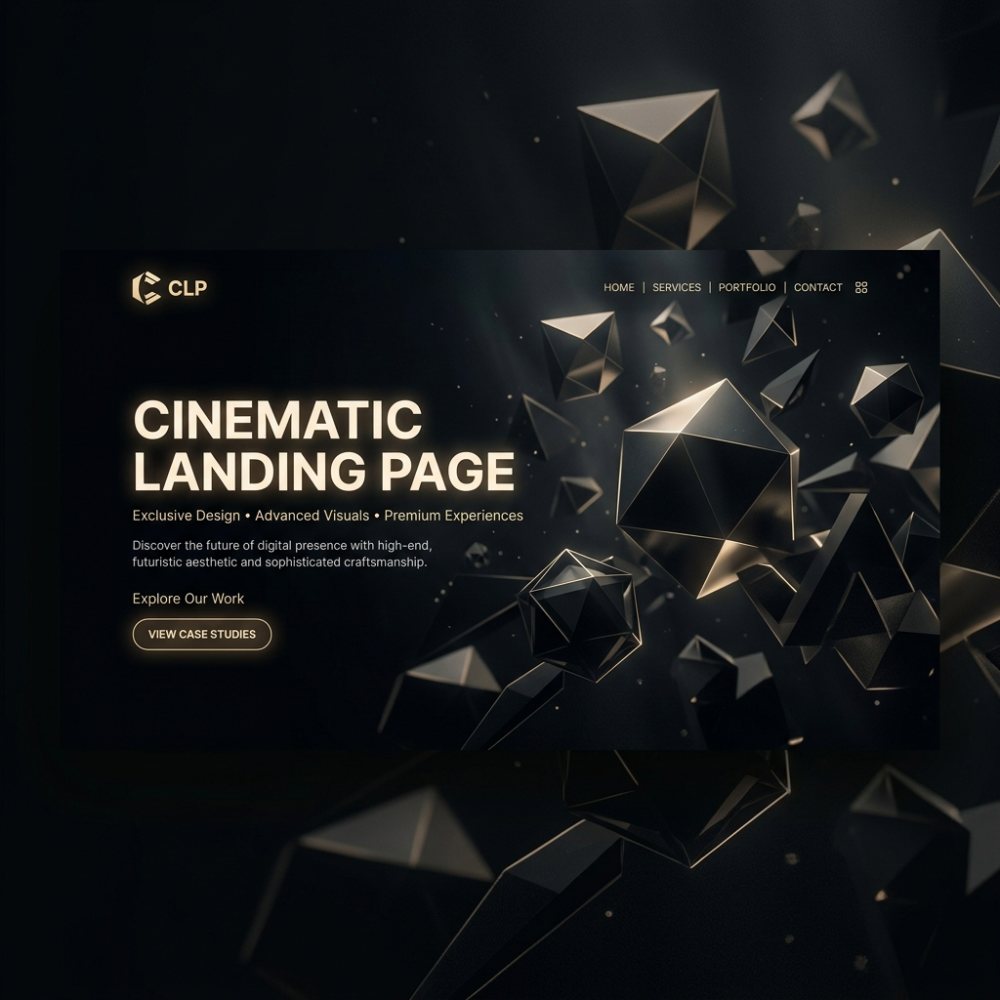

# Cinematic Landing Page Skill



Transform your AI agent into a World-Class Senior Creative Technologist. This skill enables your agent to build high-end, cinematic landing pages using Business Intelligence reasoning, adaptive architecture, and precision animations.

## Install

```bash
npx "@opendirectory.dev/skills" install cinematic-landing-page --target claude
```

### Manual Installation
1. Download this folder.
2. Open your Claude desktop app.
3. Go to **Customize** > **Skills** > **+**.
4. Upload this folder.

## Features

- **Business Intelligence (Brand Brain)**: Before building, the agent reasons through the business profile, customer archetype, and psychological levers.
- **Adaptive Design Systems**: 6 distinct style presets (Clean, Dark, Bold, Neon, Warm, Energetic) with tailored typography and palettes.
- **Advanced Tech Stack**: React 19, Tailwind CSS, GSAP, Lenis (Smooth Scroll), and Three.js for interactive 3D hero elements.
- **Precision Components**: Interactive features, manifesto sections, and high-conversion layouts.
- **Global Interactions**: Custom magnetic cursors, noise overlays, and premium page load sequences.

## How to Use

Simply ask your agent:
> "Help me build a cinematic landing page for my new [Product/Service]."

The agent will initiate **PHASE 0: The Interrogation**, asking 7 critical questions to define your brand identity, style direction, and value propositions before generating a single line of code.

## Project Structure

```text
cinematic-landing-page/
├── README.md       # Public documentation & cover
└── SKILL.md        # Master protocol & AI instructions
```

## Technical Requirements
The generated code utilizes:
- **React 19 + Vite**
- **GSAP 3** (Animation)
- **Lenis** (Smooth Scroll)
- **Three.js** (3D Elements)
- **Tailwind CSS** (Styling)
