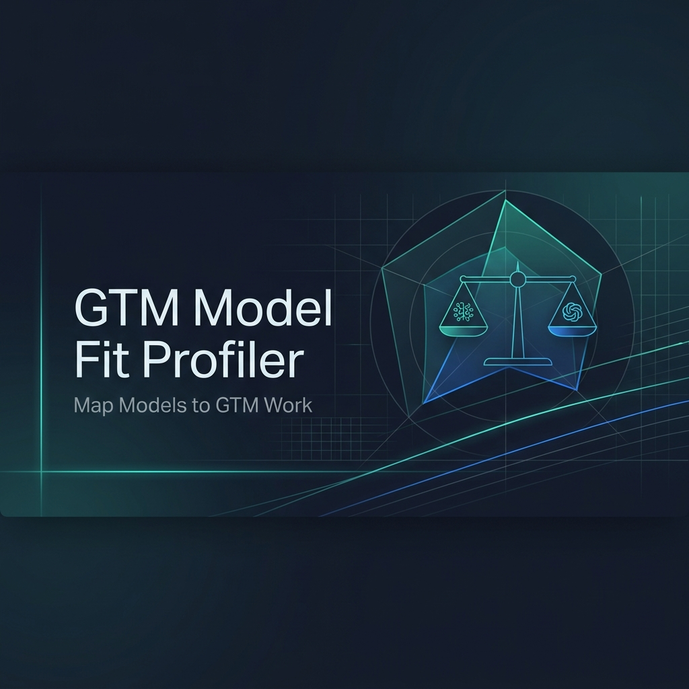

# gtm-model-fit-profiler



The skill you install **before** choosing or trusting a model for GTM work.

`gtm-model-fit-profiler` is a **meta-skill** — unlike most OpenDirectory skills that perform GTM work directly, this skill helps you choose the right model to perform that work well.

> Models should be evaluated against GTM work, not against generic intelligence claims.

Evaluate model suitability against specific GTM workloads. Get scored assessments, failure-pattern detection, and deployment-ready recommendations.

## What It Does

- Evaluates a model against a specific GTM workload (market research, pricing analysis, or outreach)
- Scores on 6 shared criteria (instruction following, specificity, groundedness, structure, confidence discipline, actionability) weighted at 60%
- Scores on 5 workload-specific criteria weighted at 40%
- Detects failure patterns (hallucination, generic filler, fake personalization, invented pricing) with severity ratings
- Supports head-to-head comparison mode with side-by-side scorecards
- Produces decision-ready deployment guidance: external-safe, human-reviewed, internal-only, or not recommended
- Saves reports to `docs/model-fit-reports/` as dated markdown files

## Requirements

| Requirement | Purpose | How to Set Up |
|------------|---------|---------------|
| Gemini API key | Model evaluation, scoring, and failure detection | aistudio.google.com → Get API key |

## Setup

```bash
cp .env.example .env
```

Fill in `GEMINI_API_KEY` (required).

No other dependencies. The skill runs entirely through agent instructions and Gemini API calls (Note: while this skill is designed to remain portable across the OpenDirectory agent ecosystem, v1 currently depends on Gemini as the evaluator model).

## How It’s Different

Most OpenDirectory skills perform GTM tasks directly:
- `map-your-market` does market research
- `pricing-page-psychology-audit` analyzes pricing
- `outreach-sequence-builder` writes outreach

This skill sits **above** those skills. It helps you decide which model to trust with the job before you run the job.

## How to Use

Evaluate a single model for market research:

```
"Evaluate Gemini 2.0 Flash for market research. Business context: B2B SaaS DevOps platform. Source material: [paste support tickets]"
```

Compare two models for outreach:

```
"Compare Claude Opus and GPT-4o for outreach personalization. Context: API monitoring tool. Signal: [paste job post]"
```

Evaluate with default benchmarks (no source material):

```
"Evaluate GPT-4o for pricing analysis. Business context: B2B data pipeline tool, $500/mo."
```

Specify a workload explicitly:

```
"Profile Claude Sonnet for market_research. Here are 8 Reddit posts about CI/CD pain: [paste posts]"
```

## Input Format

| Input | Required | Description |
|-------|----------|-------------|
| `model_a` | Yes | The model to evaluate (e.g., "Gemini 2.0 Flash", "GPT-4o") |
| `model_b` | No | Second model for comparison mode |
| `workload` | Yes | One of: `market_research`, `pricing_analysis`, `outreach` |
| `business_context` | No | Your product/market context (e.g., "B2B SaaS for DevOps teams") |
| `source_material` | No | Real content to evaluate against (pricing pages, job posts, tickets) |

If `source_material` is not provided, the skill uses built-in benchmark prompts.

## Output

For each evaluation, the skill produces:

1. **Scorecard** — markdown table with all criteria scores and one-sentence explanations
2. **Strengths** — 3-5 specific observations about where the model excels
3. **Failure patterns** — detected issues with severity ratings (low/medium/high)
4. **Deployment guidance** — separated from task-fit score, with explicit justification (external-safe / human-reviewed / internal-only / not recommended)
5. **Confidence note** — high/medium/low confidence based on evidence quality

Reports are saved to `docs/model-fit-reports/` as dated markdown files.

## Scoring Model

| Component | Weight | Criteria Count |
|-----------|--------|----------------|
| Shared criteria | 60% | 6 (instruction following, specificity, groundedness, structure, confidence discipline, actionability) |
| Workload-specific criteria | 40% | 5 (varies by workload) |

**Overall score** = `(0.6 × shared_subtotal) + (0.4 × workload_subtotal)`

| Range | Label | Meaning |
|-------|-------|---------|
| 4.5–5.0 | Excellent fit | Highly capable for this specific workload |
| 3.8–4.4 | Strong fit | Reliable but may need minor corrections |
| 3.0–3.7 | Usable with review | Requires human-in-the-loop validation |
| 2.0–2.9 | Weak fit | Struggles significantly with this workload |
| Below 2.0 | Poor fit | Fails at core workload tasks |

See `references/scoring-rubric.md` for full scoring rules and workload-specific criteria.

## Supported Workloads

| Workload | Use When |
|----------|----------|
| `market_research` | Summarizing pain points, clustering signals, identifying ICP patterns, extracting themes |
| `pricing_analysis` | Comparing pricing pages, analyzing competitor strategy, recommending pricing moves |
| `outreach` | Writing personalized cold emails, creating account-based openers, crafting GTM messages |

## When NOT to Use

- Need to rank models globally across all tasks → this skill evaluates per-workload only
- Need to evaluate for non-GTM work (coding, writing, summarization) → use a general benchmark
- Need real-time live API calls to multiple model providers → this skill uses Gemini as the evaluator
- Need to evaluate fine-tuned or custom models → this skill profiles general-purpose models

## Plays Well With

This skill is a **selection layer** — use it before running these GTM skills:

| Skill | Relationship |
|-------|-----|
| `linkedin-job-post-to-buyer-pain-map` | Profile model reliability for hiring signal analysis before running pain maps |
| `outreach-sequence-builder` | Assess model fit for outreach personalization before generating sequences |
| `pricing-page-psychology-audit` | Evaluate model accuracy for pricing analysis before running audits |
| `noise-to-linkedin-carousel` | Test content generation capabilities before carousel creation |

## Project Structure

```
gtm-model-fit-profiler/
├── SKILL.md
├── README.md
├── .env.example
├── cover.png
├── evals/
│   └── evals.json
└── references/
    ├── scoring-rubric.md
    ├── failure-patterns.md
    ├── workload-prompts.md
    └── examples.md
```

## License

MIT

## Installation in Claude Desktop App

### Video Tutorial
Watch this quick video to see how it's done:

https://github.com/user-attachments/assets/ee98a1b5-ebc4-452f-bbfb-c434f2935067

### Step 1: Download the skill from GitHub
1. Copy the URL of this specific skill folder from your browser's address bar.
2. Go to [download-directory.github.io](https://download-directory.github.io/).
3. Paste the URL and click **Enter** to download.

### Step 2: Install the Skill in Claude
1. Open your **Claude desktop app**.
2. Go to the sidebar on the left side and click on the **Customize** section.
3. Click on the **Skills** tab, then click on the **+** (plus) icon button to create a new skill.
4. Choose the option to **Upload a skill**, and drag and drop the `.zip` file (or you can extract it and drop the folder, both work).

> **Note:** Always make sure you are uploading the specific folder that contains the `SKILL.md` file!
