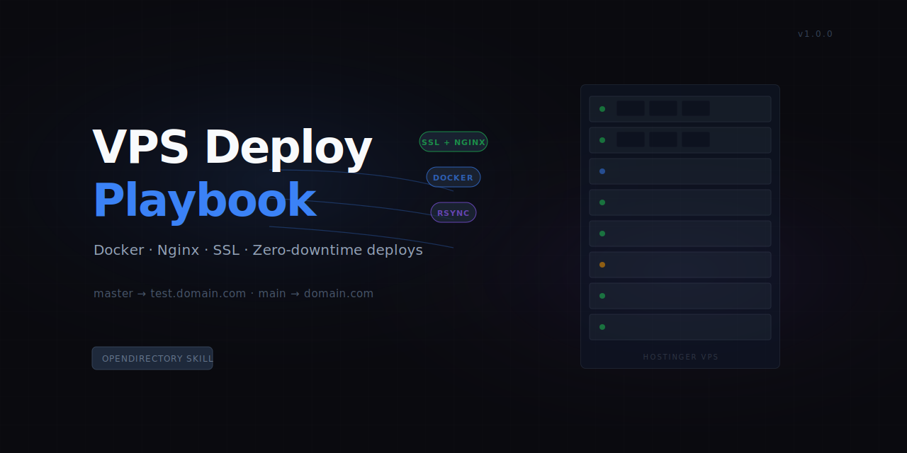

# vps-deploy-playbook

Full Docker + Nginx + SSL deployment to a Linux VPS — from local code to live HTTPS in one skill invocation.

Ships your app via rsync, builds it in Docker on the server, routes traffic through Nginx as a reverse proxy, and provisions a free SSL certificate via Let's Encrypt. Includes a two-environment branching strategy so you always verify on a test subdomain before touching production.

---

### What It Does

1. **Checks SSH connectivity** and Docker availability before touching anything
2. **Builds locally** (detects npm / pnpm / yarn / bun automatically)
3. **Transfers files** via rsync, keeping `.env` secrets separate from the file sync
4. **Builds and starts** the Docker container on the VPS (supports both Compose and standalone)
5. **Configures Nginx** as a reverse proxy with proper headers for WebSocket and HTTP/2
6. **Provisions SSL** via Certbot / Let's Encrypt with HTTP→HTTPS redirect
7. **Verifies** the live URL with a health check and reports HTTP status
8. **Prints a deployment report** with rollback instructions

### Two-Environment Strategy

```
master branch → test.yourdomain.com   (always test here first)
main branch   → yourdomain.com        (production — asks for confirmation)
```

The skill reads your current git branch and automatically routes to the right environment. Promoting from test to production is a `git merge master` away.

---

### Prerequisites

| Requirement | Details |
|---|---|
| Linux VPS | Ubuntu 20.04+ recommended. SSH access required. |
| Docker | Installed and running on the VPS |
| Nginx | Containerized (`docker exec nginx`) or system (`systemctl`) |
| Certbot | For SSL provisioning. Docker or system install. |
| SSH key | `~/.ssh/id_rsa` or `~/.ssh/id_ed25519` added to VPS `authorized_keys` |
| DNS A record | `yourdomain.com` and `test.yourdomain.com` pointing to VPS IP |
| Dockerfile | Your app must have a `Dockerfile` at the project root |

---

### Usage

Once installed, run from your project directory:

```
"Deploy this app to the VPS"
"Ship to test environment"
"Deploy to production"
"Set up nginx and SSL for this service"
```

The skill will walk through every step and ask for confirmation before touching production.

---

### Environment Variables

Copy `.env.example` to `.env` and fill in your values:

```bash
cp ~/.claude/skills/vps-deploy-playbook/.env.example .env
```

| Variable | Required | Description |
|---|---|---|
| `VPS_HOST` | Yes | VPS IP address or hostname |
| `VPS_USER` | Yes | SSH username (commonly `root` or `ubuntu`) |
| `SERVICE_NAME` | Yes | Docker container / service name |
| `DOMAIN` | Yes | Base domain (e.g. `myapp.com`) |
| `APP_PORT` | Yes | Port your app listens on inside Docker |
| `APP_DIR` | No | Deploy path on VPS. Defaults to `/opt/services/$SERVICE_NAME` |
| `SSL_EMAIL` | No | Email for Let's Encrypt cert. Defaults to `admin@$DOMAIN` |

---

### References Included

| File | Purpose |
|---|---|
| `references/NGINX-TEMPLATE.md` | HTTP and HTTPS server block templates |
| `references/DOCKER-COMPOSE-TEMPLATE.md` | Docker Compose service template |
| `references/ROLLBACK-SOP.md` | Step-by-step rollback procedures |

---

### Tested On

- Ubuntu 22.04 + Docker 24 + Nginx 1.25 (containerized)
- Ubuntu 24.04 + Docker 26 + Nginx 1.27 (containerized)
- Next.js 15 (standalone output), Node.js 18/20 apps, FastAPI (Python)
- Let's Encrypt / Certbot in Docker

---

### Author

Built by [zeroone-dots-ai](https://github.com/zeroone-dots-ai) — based on production deployments across multiple apps on Hostinger VPS.
